I build backend services in Java and Spring. I like the parts of the work where correctness matters: transactions, concurrency, and events that must not get lost.

## Stack

**Backend:** Java, Spring Boot, Spring MVC, Spring Security, Spring Data JPA, Hibernate
**Data:** PostgreSQL, Redis, Apache Kafka
**Delivery:** Docker, Docker Compose, Linux, Git, GitHub Actions
**Testing:** JUnit, Mockito, Testcontainers
**Build:** Maven, Gradle

## Contact

  
  
  

